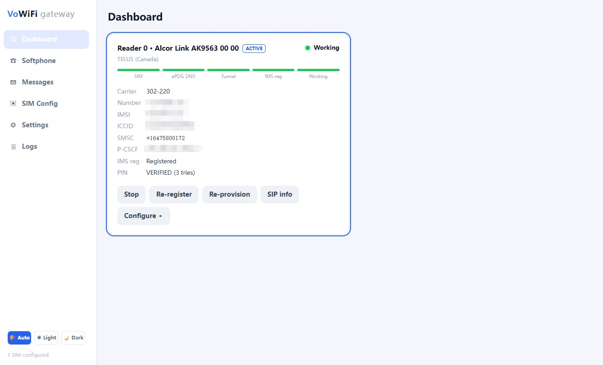
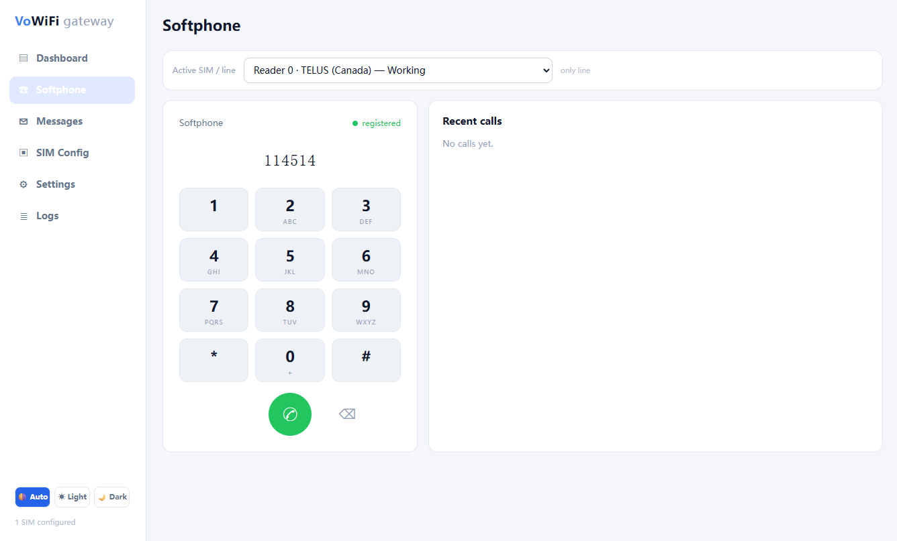
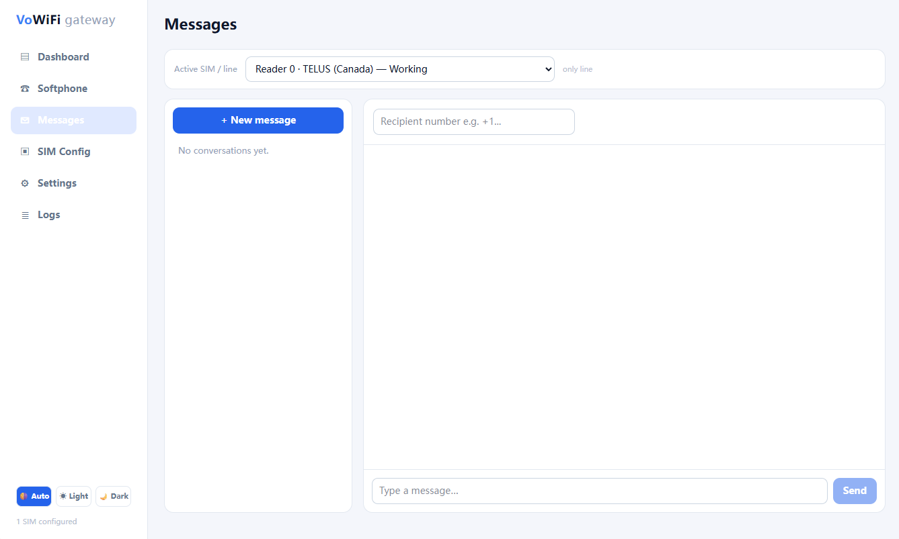

# VoWiFi→SIP Gateway

A **containerized VoWiFi→SIP gateway** that turns a physical VoWiFi-capable SIM into an IMS endpoint you can call/text via standard SIP clients (softphones, desk phones, Asterisk trunks). One SIM = one routable phone number; multiple SIMs can run in parallel (each gets its own engine container + port block).

**What it does:**
- Reads the SIM's IMS credentials (IMSI/Ki/OPc) via PC/SC
- Establishes an IPsec ePDG tunnel + IMS registration to your carrier's VoWiFi core
- Presents the registered line as a **WebRTC endpoint** (browser softphone in the control-plane WebUI) and a **SIP/RTP server** (for MicroSIP, Zoiper, Asterisk trunks, etc.) with two-way voice
- Routes outbound calls (`INVITE` to the SIP server → IMS `INVITE` over the tunnel) and inbound calls (IMS `INVITE` → rings your SIP clients)
- Sends/receives SMS via SIP MESSAGE (to/from the engine's SIP transport)

**What you need:**
- A Linux host (amd64/arm64, Raspberry Pi works) with `/dev/net/tun` + kernel ESP/XFRM
- **Docker** + a **PC/SC smart-card reader** (USB CCID)
- A **VoWiFi-capable SIM** from a carrier that allows ePDG (tested: Telus Canada 302-220; T-Mobile US + many EU carriers should work)

---

## Screenshots

The control-plane WebUI — dashboard, browser softphone, and SMS messaging (light theme; a dark theme is also built in):

| Dashboard | Softphone | Messages |
|:---:|:---:|:---:|
| [](screenshots/dashboard.jpg) | [](screenshots/softphone.jpg) | [](screenshots/message.jpg) |

- **Dashboard** — live per-SIM status (SIM → ePDG DNS → tunnel → IMS reg → working), carrier/number/IMSI/ICCID/SMSC/P-CSCF, PIN state, and per-line controls (stop, re-register, re-provision, SIP info, configure).
- **Softphone** — browser-based WebRTC dialer for placing and receiving calls on the registered line, no external client needed.
- **Messages** — per-line SMS inbox/outbox, bridging SIP MESSAGE ↔ carrier SMS.

---

## Architecture

The gateway has two planes:

1. **`vowifi/engine`** (per-SIM, always a Docker container): a pure-Python SWu IKEv2/IPsec client (`swu_ike.py`, based on [fasferraz/SWu-IKEv2](https://github.com/fasferraz/SWu-IKEv2)) for the ePDG tunnel (IKEv2 + EAP-AKA, userspace ESP) + sysmocom Asterisk (IMS PJSIP) + USIM bridge scripts (PIN keeper, AMI ↔ PC/SC). One container per SIM, each with `NET_ADMIN` + `/dev/net/tun` + its own port block (5060+, 10000+ RTP). The tunnel client carries VoWiFi resilience: it verifies the SIM PIN (CHV1) in its own PC/SC connection on every EAP-AKA authentication, sends NAT-T keepalives to hold the tunnel open when idle, runs an initiator-side liveness/DPD check to detect a silently-dead ePDG, re-syncs the P-CSCF into PJSIP on reconnect, advertises IKEv2 fragmentation (RFC 7383) and reassembles fragmented ePDG responses (fragmenting its own oversized messages too), classifies reject Notifies per 3GPP TS 24.302 §7.2.2.2 (honouring an attached back-off timer instead of hammering the network), answers the ePDG's IKEv2 `DEVICE_IDENTITY`/DPD/P-CSCF-restoration requests, and records every received 3GPP Notify — so it rekeys/re-auths and self-heals after a full re-establishment (see [Troubleshooting](#troubleshooting)).
2. **control plane** (singleton): FastAPI manager + React WebUI dashboard. Manages engine containers via the Docker SDK and reads the SIM via pyscard over the host pcscd socket.

The control plane runs in one of two **deploy modes** (chosen at install time):

- **`local`** *(default)* — the control plane runs **natively on the host** as a Python venv + a `vowifi-control` systemd service; Docker is used **only as the engine layer**. The WebUI is still compiled with a throwaway `node:22-alpine` container, so the host needs no Node/JS toolchain.
- **`docker`** — the control plane runs in a **privileged container** (host Docker socket + host pcscd socket bind-mounted), alongside the engine containers.

In **both** modes the reader is owned by the **host's pcscd**, and **pcsc-lite is version-locked** (`PCSC_VERSION`, default 2.3.3) across the host + every container image so the PC/SC client/server protocol always matches. Runtime data (`config.yaml`, per-instance configs, SQLite call logs, TLS certs) lives in `./data`.

---

## Quick Start

```bash
git clone https://github.com/pagecat/vowifi_gateway.git
cd vowifi_gateway
sudo ./install.sh install                 # default: local mode (native control plane)
# or, fully containerized:
sudo ./install.sh install --mode docker
```

The installer:
- Installs Docker (via `get.docker.com` if missing) + host pcscd, **version-locked** to `PCSC_VERSION`
- Builds the engine image from source (~10–15 min on a Pi; compiles Asterisk + pcsc-lite + the Python SWu tunnel deps; bakes `engine/patches/*`)
- **local mode**: compiles the WebUI in a throwaway Node container, creates a Python venv (`control/.venv`), and starts the `vowifi-control` systemd service
- **docker mode**: builds the `vowifi/control` image and starts the control plane in a privileged container
- Autostart is enabled; prints `https://<host-lan-ip>:8443` — open it in your browser

The chosen mode is remembered (persisted under the data dir), so `reload`/`status`/`logs`/`uninstall` don't need `--mode` again. An explicit `--mode` or the `VOWIFI_MODE` env var always overrides.

Accept the self-signed cert, then **provision your SIM** in the dashboard:
1. Insert the SIM into the reader; the `/` tab shows detected cards
2. Click **Provision** → enter the SIM PIN, set the IMEI + AMI secret. The ePDG is auto-derived from the SIM's IMSI and the SMSC is read from the SIM (EF_SMSP); if the SIM doesn't carry an SMSC you'll be asked to type one. **IMEISV** is optional — leave it blank to auto-generate one (14-digit IMEI base + a 2-digit software version); it's used to answer the carrier's IKEv2 `DEVICE_IDENTITY` request.
3. The engine container spins up and walks the state machine: `TUNNEL_DOWN` → `REGISTERING` → `OK` (IMS registered)
4. Once `OK`, the **Softphone** tab lets you dial out from the browser; external SIP clients connect to `<host-ip>:5060` (UDP) or `:5061` (TLS) / `:8089` (WebRTC/WSS)

---

## Configuration

Set via **env vars** (or a `.env` file next to `install.sh`) before running `install`:

| Env var | Default | What |
|---------|---------|------|
| `VOWIFI_MODE` | `local` | Deploy mode: `local` (native control plane, Docker engine only) or `docker` (both containerized). Overridable per-command with `--mode`. |
| `VOWIFI_PORT` | `8443` | Host port the WebUI is served/published on |
| `VOWIFI_DATA_DIR` | `<repo>/data` | Runtime data directory (config, logs, DB, certs) |
| `VOWIFI_ADVERTISE_ADDR` | auto-detect | Host LAN IP advertised to SIP/WebRTC clients for RTP (auto-detect uses `ip route get` or `hostname -I`; override if your host is multi-homed or the auto-detect picks the wrong NIC) |
| `VOWIFI_BIND` | `0.0.0.0` | Bind address for the control plane (rarely changed) |
| `PCSC_VERSION` | `2.3.3` | pcsc-lite version pinned across host + all images |

Example:
```bash
sudo VOWIFI_PORT=9443 VOWIFI_ADVERTISE_ADDR=192.168.1.100 ./install.sh install
```

---

## Lifecycle

```bash
# Check status (mode + control + engine containers)
./install.sh status

# View control-plane logs (live) — journalctl in local mode, docker logs in docker mode
./install.sh logs

# Start / stop / restart just the control plane (systemd service or container, per mode)
sudo ./install.sh start
sudo ./install.sh stop
sudo ./install.sh restart

# Run with NO arguments: installs if nothing is present, otherwise auto-detects the mode and
# opens an interactive control menu (start/stop, autostart, status, logs, reload, uninstall).
sudo ./install.sh

# Rebuild + restart the control plane (preserves data). In local mode this rebuilds the
# WebUI + refreshes the venv + restarts the systemd service; in docker mode it rebuilds
# the control image + recreates the container. The engine image is reused unless forced.
sudo ./install.sh reload

# Rebuild from scratch (no Docker build cache; also forces an engine-image rebuild)
sudo ./install.sh reload --no-cache

# Rebuild + also recreate engine containers (forces an engine-image rebuild — e.g. after
# changing engine code/patches)
sudo ./install.sh reload --engines

# Switch modes (tears down the old plane, brings up the new one, keeps data + engine image)
sudo ./install.sh install --mode docker
sudo ./install.sh install --mode local

# Disable autostart (control + engines won't restart on reboot)
sudo ./install.sh disable-autostart

# Re-enable autostart
sudo ./install.sh enable-autostart

# Uninstall (removes vowifi containers + the native service; KEEPS the patched engine image,
# venv, Docker, pcscd, and ./data so a reinstall is fast)
sudo ./install.sh uninstall

# Uninstall + delete everything (images, venv, and ./data)
sudo ./install.sh uninstall --purge

# OPT-IN: build + install a patched CCID driver (patches/ccid/*) on the host, replacing the
# distro libccid. Only needed for readers with firmware quirks — e.g. the HSIC CCID-Reader
# (1d99:0016), whose GetSlotStatus always answers "no card" so the stock driver never powers
# the SIM. Idempotent; safe to re-run. NOT part of the default install.
# The driver is built from CCID 1.6.2, which already lists 1d99:0016 in its supported-reader
# table — no manual Info.plist whitelisting needed after `patch`. (Distro libccid older than
# 1.6.2, e.g. 1.5.x, does NOT know this VID/PID: without `patch` you'd have to add it to the
# ifdVendorID/ifdProductID/ifdFriendlyName arrays in the driver's Info.plist by hand — and the
# reader still can't power the SIM, because the GetSlotStatus firmware bug needs the patch.)
sudo ./install.sh patch
```

---

## Per-instance ports

Each provisioned SIM gets a port block (no collisions across SIMs). Instance index `i` (first SIM = 1):
- SIP UDP: `5060 + 100*(i-1)`  
- SIP TLS: `5061 + 100*(i-1)`  
- WebRTC/WSS: `8089 + 100*(i-1)`  
- AMI: `5038 + 100*(i-1)` (Asterisk manager for advanced users; set credentials in the dashboard)
- RTP: `10000 + 100*(i-1)` through `+59` (60-port range per instance)

Example: the **first** SIM is on 5060/5061/8089, the **second** on 5160/5161/8189, etc.

---

## WebUI

Open `https://<host-ip>:<VOWIFI_PORT>` (default 8443). Tabs (see [Screenshots](#screenshots) above):
- **/** (Dashboard) — reader/card status, provision a SIM, engine state per instance
- **/softphone** — browser-based WebRTC dialer (click-to-call from the dashboard, or dial manually; supports inbound calls, DTMF, call recording)
- **/settings** — global config (TLS domain for Let's Encrypt, Asterisk debug toggles, ring timeout, etc.)
- **/messages** — SMS inbox/outbox (SIP MESSAGE ↔ carrier SMS, per instance)
- **/logs** — call/SMS logs with filtering

---

## External SIP clients

Once an instance reaches `OK`, connect any SIP client to the **engine's** published ports (not the control-plane port). Credentials are in the dashboard under the instance's **SIP** section:
- **Username**: `<imsi>` (15-digit, read from the SIM)
- **Password**: the **AMI secret** you set during provisioning (shared between SIP auth and Asterisk AMI)
- **Domain/Server**: `<host-ip>` (or the FQDN in `settings.tls.domain` if you set one)
- **Transport**: UDP (port 5060+offset), TLS (5061+offset), or WebRTC/WSS (8089+offset; path `/ws`)

Tested clients: **MicroSIP** (Windows), **Zoiper** (multi-platform), Asterisk PJSIP trunk. The engine's `/` context accepts any `INVITE` and hairpins it to the IMS trunk (so you dial the **target number** directly, no prefix).

---

## Carrier parameters (no database)

There is **no carrier database** — every carrier-specific value is derived from the SIM or the standard 3GPP naming scheme, so any VoWiFi-capable SIM works without a preset:

- **ePDG FQDN** — derived from the SIM's IMSI (MCC/MNC): `epdg.epc.mnc<MNC>.mcc<MCC>.pub.3gppnetwork.org`, resolved via DNS.
- **IMS realm / EAP NAI** — likewise derived: `ims.mnc<MNC>.mcc<MCC>.3gppnetwork.org`.
- **SMSC** — read from the SIM's **EF_SMSP** (`6F42`, authoritative per-SIM). If the SIM doesn't carry one, provisioning asks you to enter it, and you can always override it per-line in **SIM Config**.
- **IMEI / IMEISV** — you set the IMEI per line; the IMEISV (used to answer the ePDG's `DEVICE_IDENTITY` request) is auto-derived from it (14-digit IMEI base + a 2-digit software version) unless you provide one explicitly.

Nothing to preseed or reload — insert the SIM and provision it.

---

## Troubleshooting

**Engine stuck at `EPDG_UNRESOLVED` or `TUNNEL_DOWN`:**  
Check the ePDG FQDN resolves + is reachable on UDP 500/4500. Some carriers restrict ePDG access by geo/IP; a VPN exit in the carrier's home country can help.

**`PIN_PROBLEM`:**  
Wrong PIN, or the SIM locked (PUK needed). Re-provision with the correct PIN; if the SIM is locked, unlock it first (SIM manager tool outside this gateway).

**`REGISTERING` → timeout:**  
IKE + SIP credentials succeeded, but IMS-AKA (`REGISTER`) fails. Check the IMSI/Ki/OPc read correctly (dashboard → instance → USIM tab shows them). If Ki/OPc are wrong, the SIM can't auth; verify them with your carrier or a known-good SIM toolkit.

**Tunnel drops after a while, or a call drops mid-session:**  
Handled automatically by the Python SWu tunnel client. Behind NAT the ESP-in-UDP flow would
otherwise be dropped by the router/conntrack when idle, so the client sends periodic NAT-T
keepalives to hold it open. It also runs an **initiator-side liveness check** (RFC 7296 /
3GPP TS 24.302 §7.2.2A): after an idle period (`SWU_LIVENESS_PERIOD`, default 20 s) it sends an
acknowledged empty `INFORMATIONAL` probe, and if several consecutive probes go unanswered
(`SWU_LIVENESS_RETRIES`, default 4) it declares the ePDG dead and tears the tunnel down so the
supervisor re-establishes it — instead of sitting "connected" on a black-holed tunnel. Carriers
also periodically rekey or force a full re-authentication; because the client re-verifies the SIM
PIN (CHV1) in its own PC/SC connection on every EAP-AKA run, and a supervisor restarts it on any
exit, the tunnel recovers on its own (a brief media blip) instead of dying on a locked card — and
the newly assigned P-CSCF is re-synced into PJSIP so calls/SMS keep routing. No action needed;
watch it in the IKE (SWu) log (`VoWiFi: VERIFY CHV1 ok`, `tunnel CONNECTED`, `liveness: …`).

**Diagnosing an unexpected tunnel drop:**  
The SWu client records **every** IKEv2 Notify the ePDG sends (3GPP TS 24.302 error + status
types), with a friendly description. Notify types it doesn't specifically act on are logged with
an extra `UNHANDLED Notify …` line carrying the full payload hex — so when a carrier tears a
tunnel down for a non-obvious reason (backoff timer, PLMN/RAT restriction, reactivation request,
a vendor-private code, …), the cause is captured in the IKE (SWu) log rather than lost. Look for
`received Notify:` / `UNHANDLED Notify` around the disconnect.

**SWu client — 3GPP TS 24.302 conformance & non-goals:**  
The client implements the parts of TS 24.302 that matter for a stable single-PDN VoWiFi attach:
EAP-AKA over IKEv2; IPv6-only CFG for the P-CSCF (accepting either an `INTERNAL_IP6_ADDRESS` or an
`INTERNAL_IP6_SUBNET` prefix, from which a stable inner address is derived); `DEVICE_IDENTITY`;
P-CSCF restoration (plus optional reselection-support advertisement, `SWU_PCSCF_RESELECTION_SUPPORT`);
IKEv2 fragmentation (RFC 7383) — advertised, with inbound reassembly **and** outbound fragmentation
of an oversized message; reject-Notify back-off classification (§7.2.2.2); initiator liveness/DPD
refreshed by both IKE and ESP traffic (§7.2.2A); correct handling of ePDG-initiated `CREATE_CHILD_SA`
(classified as IKE-rekey / ESP-rekey / additional-bearer and answered with the right Notify) and
`DELETE` (SPI-mapped response, `INVALID_SPI` on an unknown SPI, `REACTIVATION_REQUESTED_CAUSE`
honoured); IKE request retransmission with responder-side duplicate-request suppression; and an
env-selectable APN-FQDN IDr (§7.2.2.1, `SWU_IDR_MODE=fqdn`; the Telus-verified bare-APN form is the
default). The following are **conscious non-goals** (out of scope for this gateway — where the
network requests them the client refuses cleanly and the supervisor re-establishes): in-place
IKE-SA / ePDG-initiated ESP-SA rekey *acceptance* (a UE-initiated proactive ESP rekey with PFS is
done instead); multiple-bearer PDN (additional bearers are safely refused with `NO_ADDITIONAL_SAS`;
no EPS-QoS/TFT); ePDG AUTH-payload signature verification (EAP-AKA `AT_MAC` already gives mutual auth
in practice); MOBIKE / `UPDATE_SA_ADDRESSES` (the host has a stable wired IP); multiple-authentication
/ external-AAA (PAP/CHAP); and emergency sessions / N1-mode-5GS.

**Audio one-way or none:**  
- **Browser softphone silent**: hard-refresh (Ctrl+Shift+R) to load the latest WebUI bundle (the audio attach fix). Check the browser Console for `audioblocked` or autoplay errors.
- **External client no audio**: confirm `VOWIFI_ADVERTISE_ADDR` is the correct LAN IP (not 127.x, not a docker-bridge IP). Check firewall rules allow RTP (UDP 10000–10059+ inbound).
- **Outbound works, inbound fails**: your router's NAT may mangle the SIP `Contact` header. Use the TLS transport (port 5061) if your client supports it, or set `settings.tls.domain` to a public FQDN + port-forward.

**Control plane won't start:**  
Check its logs with `./install.sh logs` (that's `journalctl -u vowifi-control` in local mode, `docker logs vowifi-control` in docker mode). Common causes: `/run/pcscd/pcscd.comm` missing (host pcscd not running) or Docker not reachable (in docker mode the control container must be privileged; in local mode the service runs as root so it can reach the reader + Docker socket).

---

## Development

**Local mode already IS the dev-friendly path**: the control plane runs natively from `control/`, so editing `control/app/*.py` + `sudo ./install.sh restart` reloads it. To live-edit **engine** scripts without rebuilding the image, start the control plane with `VOWIFI_DEV_MOUNTS=1` set — the manager then bind-mounts the local `engine/*.py` + templates into each engine container as read-only overlays, so an edit + `docker restart vowifi-engine-<id>` applies immediately.

**Control-plane only, by hand** (outside the installer): create a venv, `pip install -r control/requirements.txt`, `export VOWIFI_DATA=./data`, `python control/run.py`. The WebUI dev server (`cd webui && npm run dev`) proxies `/api` + `/ws` to the control plane — point it with `VOWIFI_DEV_API=https://<gateway-host>:8443` (defaults to `localhost:8443`).

**Manual build**:
```bash
docker build -t vowifi/engine engine/
docker build -t vowifi/control -f control/Dockerfile .
```

---

## State machine (per instance)

```
NO_CARD → (card inserted) → PIN_PROBLEM → (PIN verified) →
EPDG_UNRESOLVED → (DNS + routing ok) →
TUNNEL_DOWN → (IKEv2 EAP-AKA succeeds) →
REGISTERING → (IMS REGISTER 200 OK) →
OK
```
`STOPPED` = user-initiated stop. Each transition logs to the engine's `/logs/<id>/entrypoint.log` and posts an event to the control plane (state + timestamp in the dashboard). The control plane also polls engine status files (`/run/<id>/status`, bind-mounted from the data dir).

---

## License

Released under the [MIT License](LICENSE). The build pulls in third-party components under their own licenses:
- [phcoder/asterisk-docker](https://github.com/phcoder/asterisk-docker) (sysmocom VoWiFi-enabled Asterisk)
- [fasferraz/SWu-IKEv2](https://github.com/fasferraz/SWu-IKEv2) (pure-Python SWu ePDG IKEv2/IPsec client)
- [mitshell/CryptoMobile](https://github.com/mitshell/CryptoMobile) + [mitshell/card](https://github.com/mitshell/card) (Milenage / USIM helpers)
- [pyscard](https://pyscard.sourceforge.io/) (PC/SC, LGPL)

---

## Tested carriers

| MCC-MNC | Carrier | Status | Notes |
|---------|---------|--------|-------|
| 302-220 | Telus (CA) | ✓ works | ePDG auto-derived from IMSI, full two-way voice + SMS |
| 234 (EE) | CTExcel (UK, on EE) | ✓ works | China Telecom MVNO on EE's UK network |
| 310-260 | T-Mobile (US) | untested | should work; ePDG auto-derived from IMSI |

Any VoWiFi-capable SIM should work without configuration (ePDG/realm derived from the IMSI, SMSC from the SIM). Reports of additional working carriers welcome.

---

## Credits

Concept + implementation: exploring IMS/VoWiFi as a SIP bridge use case. Builds on the excellent work by phcoder (sysmocom Asterisk VoWiFi integration), fasferraz (SWu-IKEv2 ePDG client), mitshell (CryptoMobile / card), and the pySIM community.
